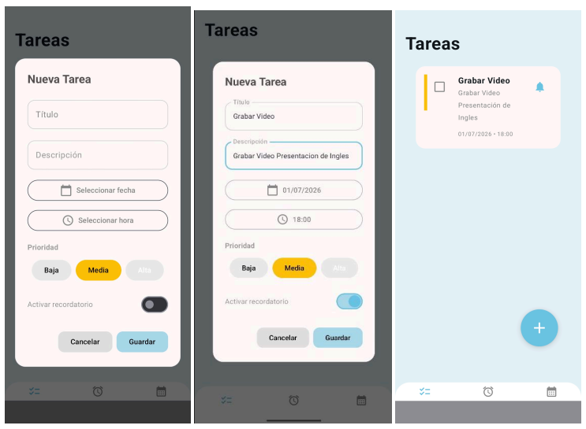
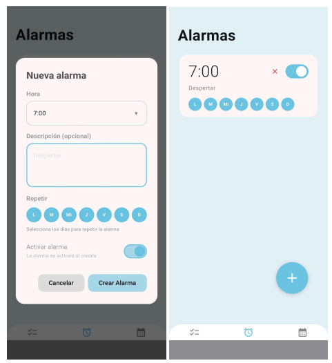
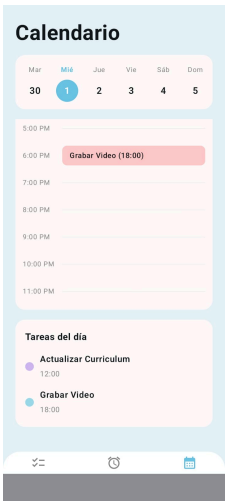
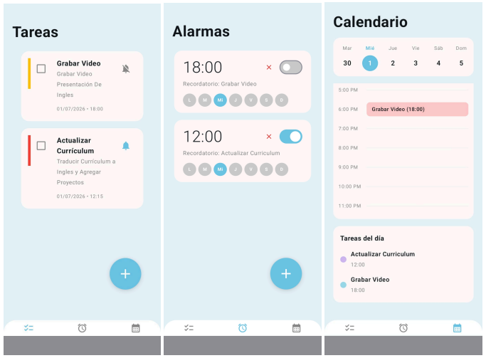

# 📱 Aplicación móvil para Android: Taskify


>  **Estado del proyecto: En desarrollo** 

##  Descripción

Taskify es una aplicación móvil desarrollada para Android que integra la administración de tareas, un calendario semanal y un sistema de alarmas dentro de una sola plataforma, permitiendo organizar actividades y recordatorios de manera sencilla e intuitiva.
La aplicación fue desarrollada utilizando **Kotlin**, **Jetpack Compose** y la arquitectura **MVVM (Model–View–ViewModel)**, proporcionando una estructura organizada, escalable y fácil de mantener. En esta etapa del desarrollo, la información se almacena temporalmente en memoria para validar la lógica de la aplicación antes de incorporar una base de datos local y los servicios nativos de Android.

---

#  Objetivo del proyecto
Desarrollar una aplicación móvil que ayude a estudiantes y usuarios a organizar sus actividades diarias mediante una lista de tareas, un calendario semanal y un sistema de alarmas integrados dentro de una sola aplicación, ofreciendo una experiencia intuitiva y centralizada.

---

#  Funcionalidades implementadas

*  Administración de tareas.
*  Registro de nuevas tareas.
*  Selección de fecha mediante Material DatePicker.
*  Selección de hora mediante Material TimePicker.
*  Asignación de prioridades (Alta, Media y Baja).
*  Activación de recordatorios.
*  Administración de alarmas.
*  Calendario semanal.
*  Navegación entre pantallas.
*  Sincronización temporal entre tareas, calendario y alarmas.
*  Gestión del estado mediante ViewModel.
*  Componentes reutilizables desarrollados con Jetpack Compose.

---

#  Funcionalidades en desarrollo

*  Integración con Room Database.
*  Persistencia local de la información.
*  Notificaciones nativas de Android.
*  Integración con el calendario del dispositivo.
*  Edición y eliminación permanente de tareas.
*  Optimización del rendimiento y experiencia de usuario.

---

#  Tecnologías utilizadas

## Lenguaje
* Kotlin

## Framework de interfaz
* Jetpack Compose
* Material Design 3

## Arquitectura
* MVVM (Model - View - ViewModel)

## Componentes Android
* ViewModel
* Navigation Compose
* State Management

## Herramientas
* Android Studio

---

#  Arquitectura del proyect
Taskify implementa la arquitectura **MVVM**, separando la interfaz gráfica, la lógica del negocio y la administración de los datos para facilitar el mantenimiento y crecimiento de la aplicación.

```text
             Usuario
                │
                ▼
      View (Jetpack Compose)
                │
                ▼
          ViewModel
                │
                ▼
      Repository (Data)
                │
                ▼
 Almacenamiento temporal
```

Esta organización permite reutilizar componentes, administrar el estado de la interfaz y preparar la incorporación de una base de datos local sin modificar la estructura principal del proyecto.

---

#  Capturas de la aplicación

##  Administración de tareas



Este módulo permite registrar nuevas tareas ingresando un título y una descripción. Además, el usuario puede seleccionar una fecha mediante **Material DatePicker**, establecer una hora con **Material TimePicker**, asignar una prioridad (**Alta**, **Media** o **Baja**) y activar un recordatorio para la actividad. Durante esta etapa, la información se almacena temporalmente en memoria para validar la lógica del sistema antes de integrar una base de datos local.

---

##  Administración de alarmas



El módulo de alarmas permite crear nuevos recordatorios mediante una ventana de diálogo donde el usuario configura la hora, una descripción, los días de repetición y su estado de activación. Al confirmar el registro, la alarma se agrega correctamente a la lista, comprobando el funcionamiento de la comunicación entre pantallas y la arquitectura MVVM.

---

##  Calendario semanal



El calendario semanal muestra visualmente las tareas registradas según la fecha seleccionada, facilitando la planificación y organización de actividades. Esta vista permite consultar rápidamente los eventos programados dentro de una misma interfaz.

---

##  Sincronización entre módulos



La aplicación sincroniza temporalmente la información entre los módulos de **Tareas**, **Calendario** y **Alarmas**. Al registrar una tarea con fecha y hora, la información se refleja automáticamente en los demás módulos relacionados, evitando capturar los mismos datos varias veces y validando la comunicación entre componentes antes de incorporar almacenamiento permanente.

---

#  Conocimientos aplicados

Durante el desarrollo de Taskify se aplicaron conocimientos relacionados con:

* Desarrollo de aplicaciones móviles para Android.
* Kotlin.
* Jetpack Compose.
* Material Design 3.
* Arquitectura MVVM.
* Programación declarativa.
* Administración del estado mediante ViewModel.
* Componentes reutilizables.
* Navegación entre pantallas.
* Modelado de software.
* Organización de proyectos Android.
* Control de versiones con Git y GitHub.

---

#  Aprendizajes del proyecto

Taskify permitió fortalecer habilidades en el desarrollo de aplicaciones móviles modernas mediante Jetpack Compose y la arquitectura MVVM. Durante esta etapa se validó la navegación entre módulos, la comunicación entre pantallas y la sincronización temporal de la información utilizando almacenamiento en memoria.

Esta base permitirá incorporar en futuras versiones una base de datos local mediante Room, así como la integración con las notificaciones y el calendario del sistema Android para ofrecer una solución más completa y funcional.

---

#  Roadmap

*  Arquitectura MVVM.
*  Interfaz con Jetpack Compose.
*  Gestión de tareas.
*  Calendario semanal.
*  Sistema de alarmas.
*  Sincronización entre módulos.
* Trabajando en: Persistencia con Room Database.
* Trabajando en: Notificaciones nativas de Android.
* Trabajando en: Integración con calendario.
* Trabajando en: Mejoras de experiencia de usuario.

---

#  Autor

**Kalecxa Guadalupe Sandoval Encines**

Estudiante de Ingeniería en Sistemas Computacionales.


GitHub: **@kalest05**
